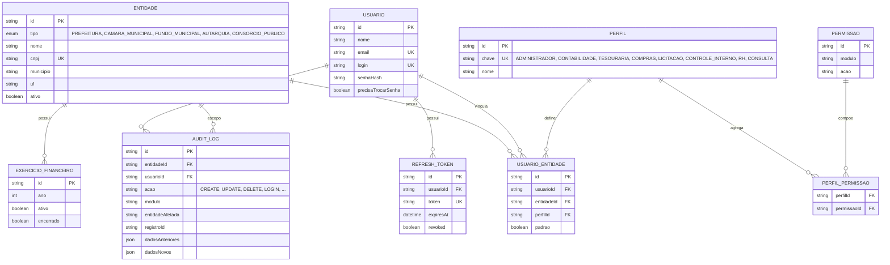
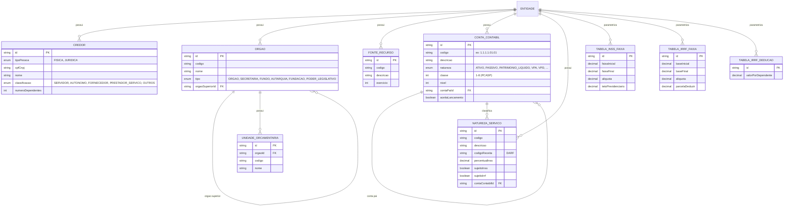
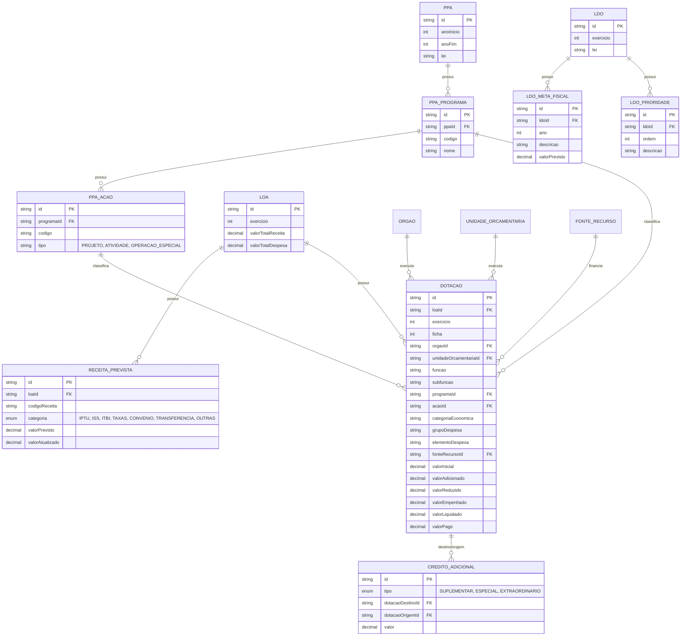
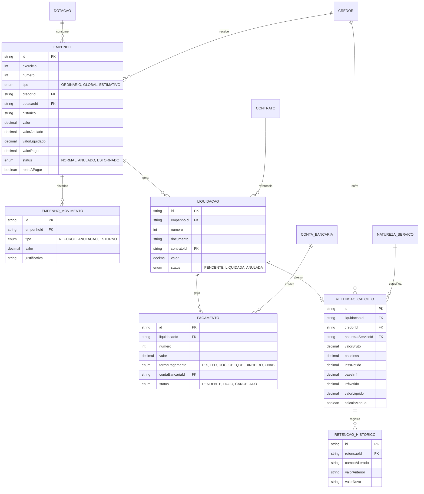
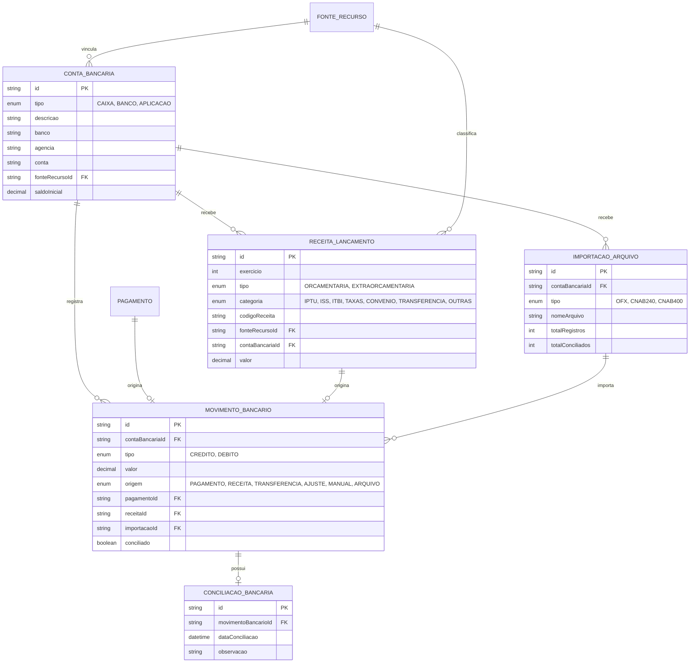
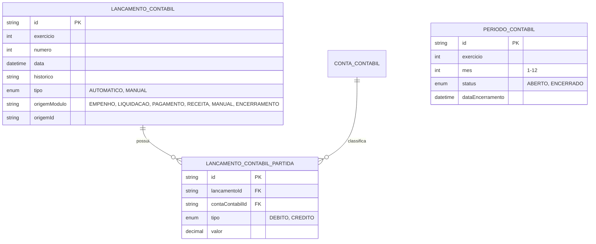
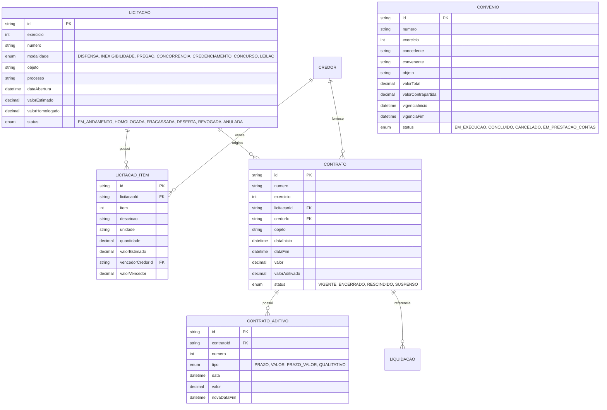
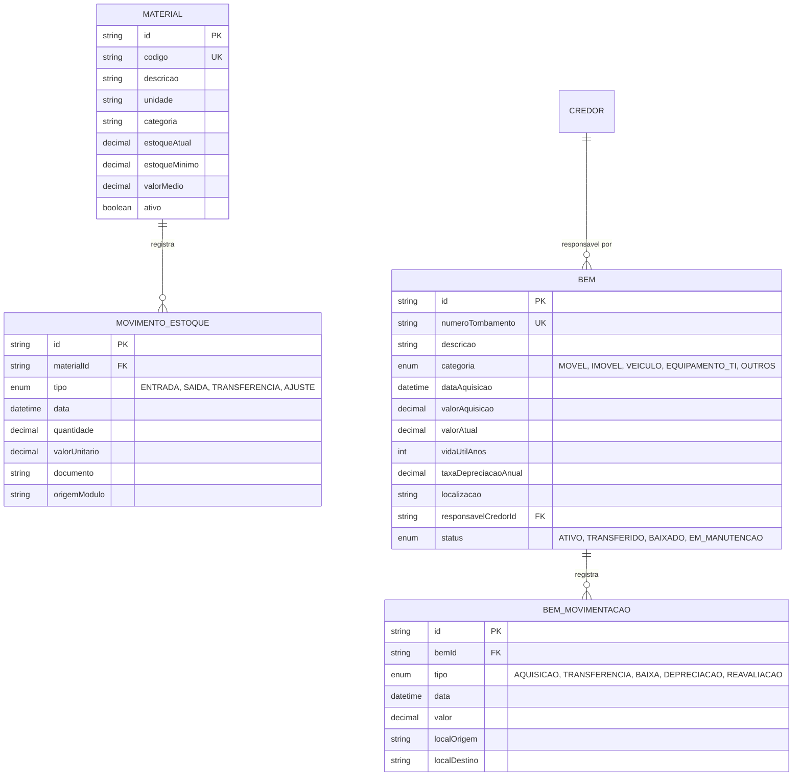
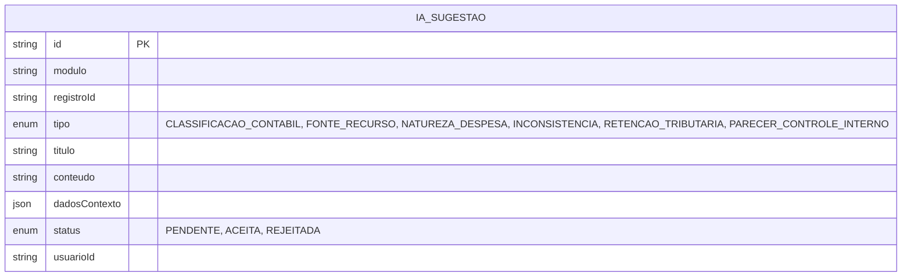

# Modelo de Dados - SIGM

Fonte da verdade: [`backend/prisma/schema.prisma`](../backend/prisma/schema.prisma).

O banco e **multi-tenant via schema unico**: quase todas as tabelas abaixo possuem uma coluna
`entidadeId` (FK para `entidades`), omitida nos diagramas para legibilidade. Todas as entidades de
negocio possuem tambem `createdAt`, `updatedAt` e `deletedAt` (exclusao logica), igualmente omitidos.

Os diagramas estao agrupados por dominio funcional para facilitar a leitura. Renderizam automaticamente
em ferramentas com suporte a Mermaid (GitHub, GitLab, VS Code, etc.).

## 1. Core / Multi-tenant / Autenticacao / RBAC / Auditoria

## 2. Cadastros (Credores, Estrutura Organizacional, PCASP)

## 3. Orcamento (PPA / LDO / LOA / Dotacoes / Creditos Adicionais)

## 4. Execucao Orcamentaria (Empenho / Liquidacao / Pagamento / Retencoes)

## 5. Tesouraria e Receitas

## 6. Contabil (PCASP - Partidas Dobradas)

## 7. Licitacoes, Contratos e Convenios

## 8. Almoxarifado e Patrimonio

## 9. Inteligencia Artificial (Sugestoes)

`IA_SUGESTAO` referencia livremente registros de outros modulos via `modulo` + `registroId`
(sem FK fisica), permitindo sugestoes sobre qualquer entidade do sistema (ex.: uma `Liquidacao`,
uma `Dotacao`, um `Pagamento`).

## Convencoes Gerais

- **Chaves primarias**: `String @id @default(uuid())` em todas as tabelas.
- **Soft delete**: `deletedAt DateTime?` - registros "excluidos" permanecem no banco com `deletedAt` preenchido.
- **Auditoria**: campos `createdAt`/`updatedAt` automaticos via Prisma (`@default(now())` / `@updatedAt`).
- **Valores monetarios**: `Decimal` com precisao `(18, 2)` (ou `(5, 2)` para aliquotas/percentuais).
- **Unicidade por tenant**: chaves de negocio (ex.: `numero` de empenho, `codigo` de material) sao unicas
  por `entidadeId` (e, quando aplicavel, por `exercicio`), via `@@unique([entidadeId, ...])`.
